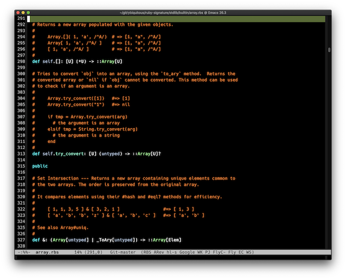

[](https://melpa.org/#/rbs-mode)

# rbs-mode

This is a Emacs major mode for editing [RBS](https://github.com/ruby/rbs) (a type signature language for Ruby).



## Getting started

You can install the package from [MELPA](https://melpa.org/#/getting-started) (recommeded), or download it directly as below:

1. Download it, e.g.

   ```shell
   curl -L https://raw.githubusercontent.com/ybiquitous/rbs-mode/HEAD/rbs-mode.el -o ~/.emacs.d/elisp/rbs-mode.el
   ```

2. Edit your `~/.emacs.d/init.el`:

    ```elisp
    (add-to-list 'load-path "~/.emacs.d/elisp")
    (require 'rbs-mode)
    ```

When the installation is completed, let's try to open a RBS file!

1. Download RBS files via `git clone https://github.com/ruby/rbs.git`
2. Open a file: <kbd>C-x C-f</kbd> [`core/object.rbs`](https://github.com/ruby/rbs/blob/42c4f166589e6ec60ea82824118ce2b6e9235fe8/core/object.rbs),

## Contributing

Welcome to your contribution! Feel free to open an issue or pull request.
